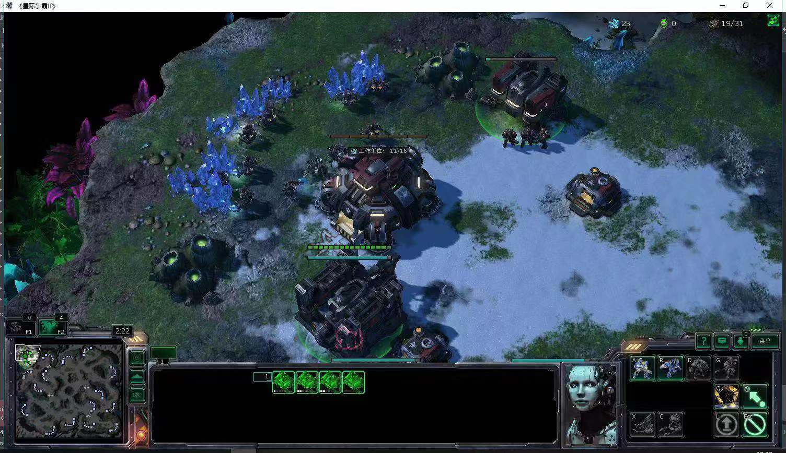
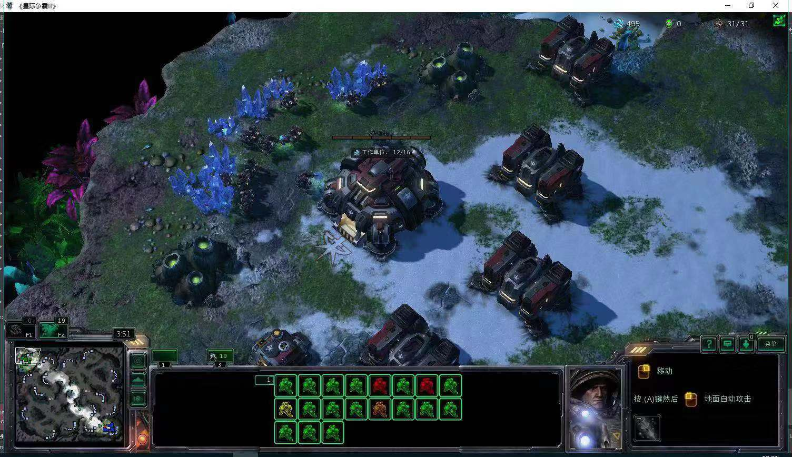
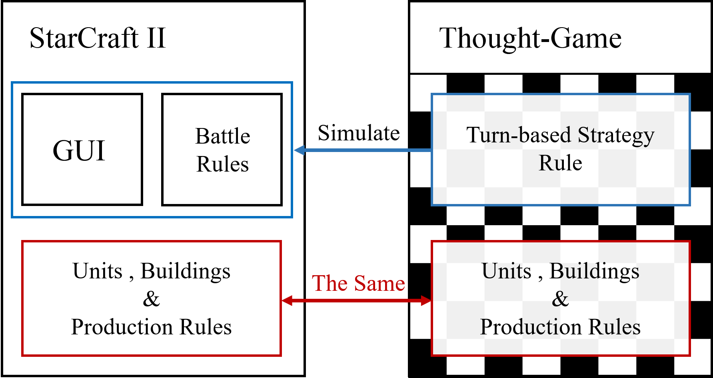
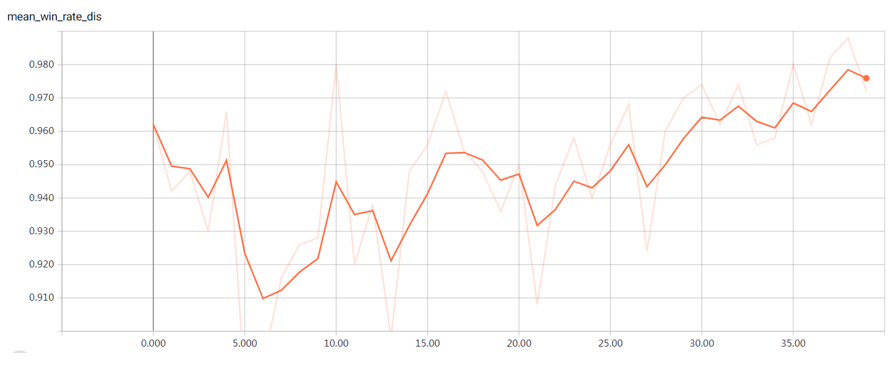
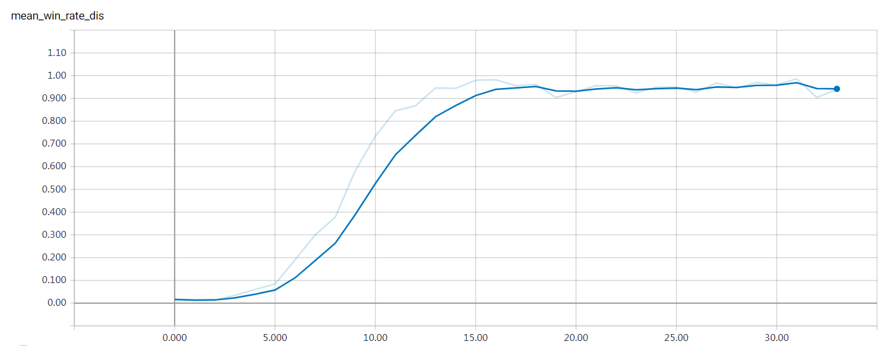
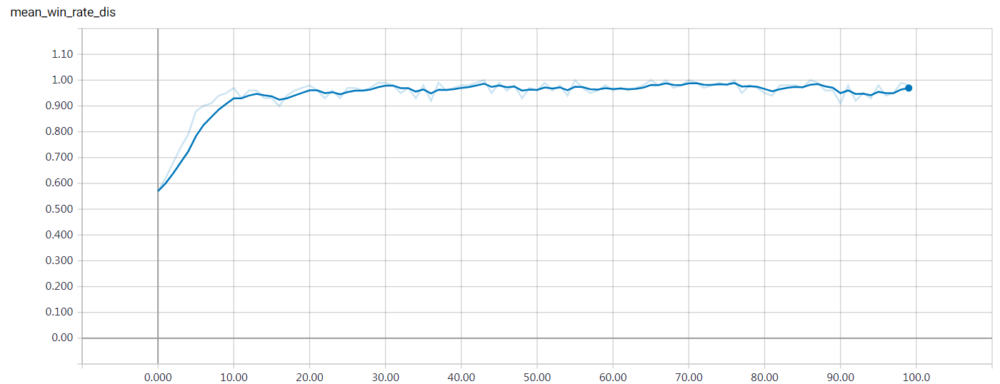
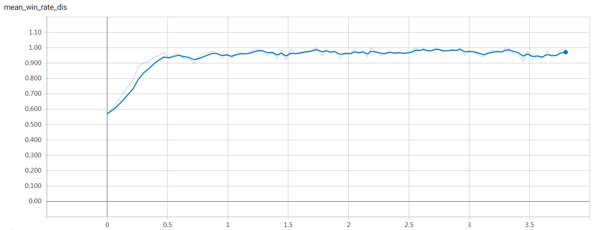

# Thought-SC2

## Update
We have changed the name from "Mind-Game" to "Thought-Game" to prevent confusion.

## Introduction

This is the code corresponding to the paper "Efficient Reinforcement Learning with a Thought-Game for StarCraft". 

Our method has the following characteristics: 
* **Efficient**: It takes only a few hours to train an agent that defeats built-in elite difficulty (difficulty 7) bot; 
* **Scalable**: Our approach can be easily extended to other races and maps and achieved good performance in these settings; 
* **Simple**: There is no need to design manual rewards in our method, nor does it require complex architectures.

Here are two screenshots of our agent (Terran) in the game which can be seen below:

**Terran agent at start**


**Terran agent at winning time**


## What is the Thought-game model?

This is a mixed model which combines the accurate part of information of SC2 units and buildings and inaccurate part which contains a turn-based simulated battle system partially inspired by the game of 'Heroes of Might and Magic III'. 

The directory structure is as follows:
```
mind-SC2/
          |->strategy/
                |-> agent.py              * base classs of transition part
          |->unit/
                |-> units.py              * base classs of unit and building part
                |-> protoss_unit.py       * units for protoss from SC2
                |-> terran_unit.py        * units for terran from SC2
                |-> zerg_unit.py          * units for zerg from SC2
          |->mini_agent.py                * transition part for protoss
          |->strategy_env.py              * battlefield part
```

Our thought-game is divided into two parts, one is the information of units and buildings extracted from SC2, and the other is the rule. The former can be automatically generated. For example, we can download from [wiki](https://liquipedia.net/starcraft2/units) and turn it into python classes. The latter needs to be implemented manually. The design of thought-game can be seen below: 

**Design of Thought-SC2**


## How to train an agent (P vs. T) in thought-game?

### Requirements
- python==3.5
- tensorflow==1.5

### Usage
Run train_by_dummy.py to train an agent of P vs. T in thought-game in a distributed setting. See train_by_dummy.py for more parameters.

**Run testing**
```
python train_by_dummy.py --restore_model=True --show_details=True
```

**Important Parameters**
```
--restore_model:    Whether to restore old model.
--num_for_update:   How many episodes for one iteration.
--parallel:         How many process to run, debug set to 1, training set to 10.
--thread_num:       How many threads in one process, debug set to 1, training set to 5.
--port_num:         Port number for distribute training in tensorflow.
--train_iters:      How many iterations for training.
--show_details:     Weather to show details of one mind-game, debug set to True, training set to False.
```

**Run training**
```
python train_by_dummy.py 
```

### Results

**ACRL**


**ACRLfromScratch**


## How to train an agent (P vs. T) defeating difficulty 7 bot of SC2 in one hour ?

### Requirements
- python==3.5
- tensorflow==1.5
- future==0.16
- pysc2==1.2
- matplotlib==2.1
- scipy==1.0

**Notes:**

If you install pysc2==1.2 and find this error "futures requires Python '>=2.6, <3' but the running Python is 3.5.6", then try first install futures as follow
```
pip install futures==3.1.1
```
then install pysc2==1.2, and this problem is solved.

**Notes:**

You can also install all requirements by one command:
```
pip install -r requirements.txt
```
**Notes:**

If you find this warning "[features.py:361] Unknown ability 3757 seen as available." too many, you can go to the pysc2 folder and find the code of features.py and comment the line 361 code.

### Usage
Run eval_mini_srcgame.py to train an agent (P vs. T) in StarCraft II. See eval_mini_srcgame.py for more parameters. 

**Run testing**
```
python eval_mini_srcgame.py --on_server=False 
```

**Important Parameters**
```
--training:         Whether to train an agent.
--restore_model:    Whether to restore old model.
--on_server:        If want to train on a server in distributed setting, set it to ture.
--map:              Name of a map to use. Default is Simple64.
--agent_race:       Agent's race. Default is P.
--bot_race:         Bot's race. Default is T.
--difficulty:       Bot's strength. Default is 7.
--port_num:         Port number for running SC2.
--max_iters:        How many iterations for training.
--step_mul:         Game speed. Set to 1 while testing. Set to 8 while training.
```

**Run training (transferring from mind-game)**
```
python eval_mini_srcgame.py --restore_model_path="./model/20190121-212908_mini/" --on_server=True --step_mul=8
```

### Results

**Transfer learning**


**Transfer learning (x_axis is hour)**


### Time Benchmark

**Environment**

| Server | CPU | Num of CPU cores | GPU | Num of GPUs |
|--------|:---------:|:------:|:------:|:------:|
| 1 Server |Intel(R) Xeon(R) CPU E5-2650 v4 @ 2.20GHz| 48 | GTX 1080Ti | 4 |

**Notes:**

When training on server, we use a distributed training setting which is that we set the running process to 10 and threads in each process to 5. By using this distributed setting, we can run multi SC2 instances at the same time to speed up training.

**Time Cost**

| Method | Time in Step_1 | Time in Step_2 | Time in Step_3 | Overall Traning Time | Traning Time (in hours) |
|--------|:---------:|:------:|:------:|:------:|:------:|
| Ours   | 20min15sec  | 21min50sec  | 23min17sec  | 65min  | 1.08 |

**Notes:**

Step_1 refer to training time in difficulty level-1 of mind-game. Step_2 refer to training time in difficulty level-2 to level-7 of mind-game. Step_3 refer to training time in difficulty level-7 in original SC2 environment.

## Docs
| Doc | Explanation
|------|----------
| [technical-report](docs/technical-report.pdf) |  introducing our previous attempts to use model-based RL on SC2
| [appendix](docs/appendix.pdf) | describing the design of the thought-sc2, training architecture, state space, etc

## LICENSE
MIT LICENSE

## Citation
Please cite our paper if you find this repository useful.

## TODO
- [x] Thought-game model
- [x] P vs. T in thought-game by ARCL
- [x] P vs. T in SC2 (Simple64, difficulty 7) by transfer learning
- [ ] Z vs. Z in thought-game by ARCL
- [ ] T vs. T in thought-game by ARCL

## FAQ

Of course, you may have some questions about our project. 

We put the most frequently asked questions into the [FAQ](docs/FAQ.md).

If you don't find the question you want in the FAQ, you can open a new issue to ask that.


